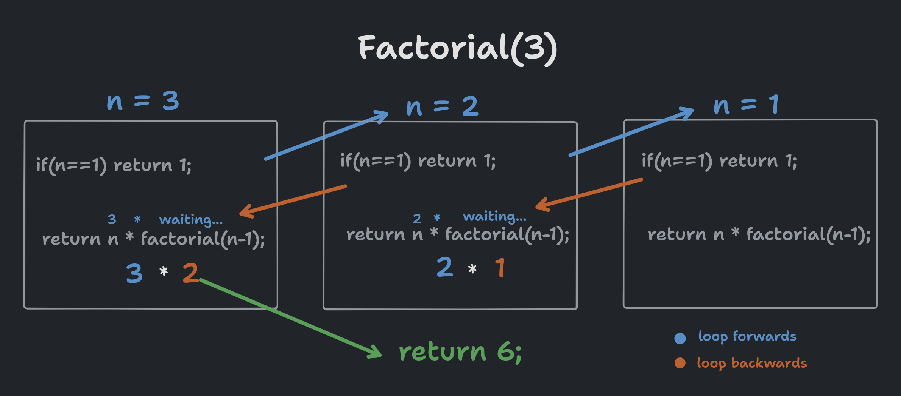
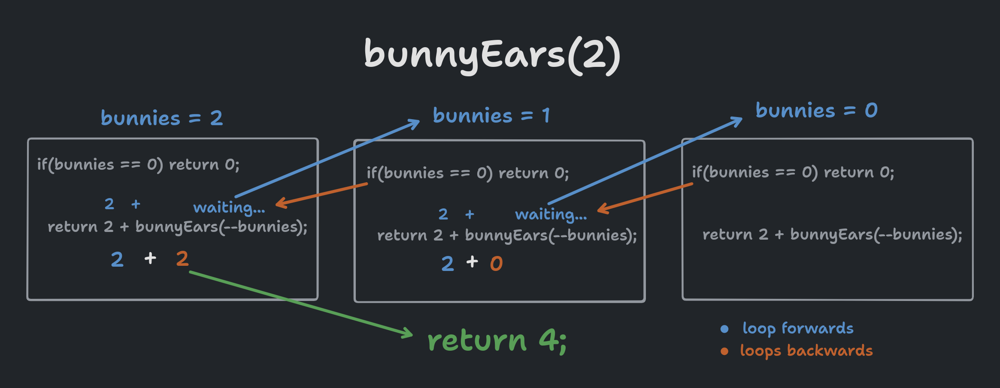
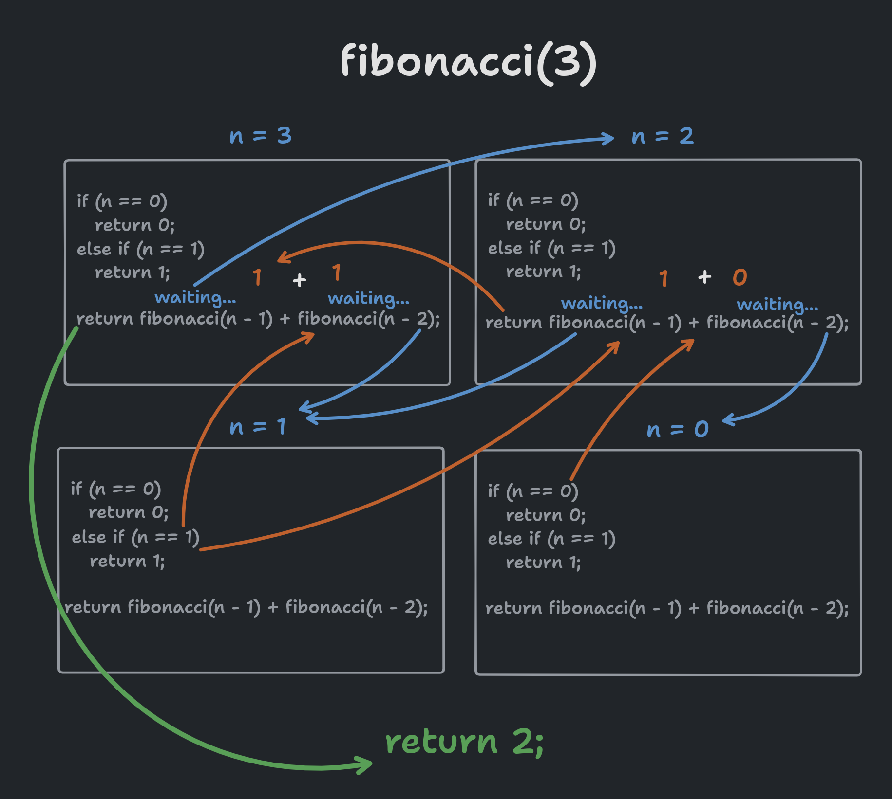

# Java Recursion Exercises.

A set of recursion exercises in java, algorithm explanation, tips, tracks and solutions. 

## Installation

In order to test the code, just download the Main.java file and run:

```bash
  javac Main.java
  java Main
```

## Introduction to Recursive Algorithms.

In this repository, you will find a collection of recursive algorithms explained and demonstrated. If you're new to recursion or want to reinforce your understanding, I recommend watching this informative video: https://www.youtube.com/watch?v=70ESDR5YQtY

The video beautifully illustrates the concept of recursion using a set of bricks arranged in a domino effect. Each brick pushes the next one, creating a cascading effect until the final brick is accommodated. Once the last brick is in place, the process starts again, but in reverse, until it reaches the very first brick. This looping pattern reflects the essence of recursion.

**Understanding Recusion in Code:**  Now that we have a general understanding of recursion, let's explore how it works in code. We'll use the bricks video as an example.

```java
void arrangeBricks(Brick[] bricks) {
  if (Is there a brick next to me?) {
    pushBrick(current brick);
    return arrangeBricks(nextBrick);
    acommodateBrick();
  } else {
    return; // No more bricks! Let's exit the function.
  }
}
```
Here, we have a function called arrangeBricks that takes an array of bricks as input. The initial if statement checks if there is another brick next to the current one. If so, it pushes the next brick and recursively calls arrangeBricks with the next brick as an argument. Note that each recursive call waits for the subsequent call to return the pushed brick to accommodate it. In case there are no more bricks, the function simply exits.

Recursion allows us to create loops by calling the same function repeatedly. Each iteration waits for the recursive function to return a value or perform an action, allowing us to utilize the returned value effectively.

Now that we have a better understanding of recursive algorithms, let's dive into the exercises included in this repository and further enhance our skills.

## Excercises, Tips, Clues and Solutions.

 - **Factorial**

A factorial number is a mathematical concept that represents the multiplication of all positive integers from 1 to a given number. It is denoted using the exclamation mark symbol (!). For example, the factorial of 5 is written as 5! and is calculated by multiplying 5 by 4, then by 3, then by 2, and finally by 1, resulting in 120. Factorial numbers are used in various areas of mathematics and statistics, as well as in recursive algorithms and combinatorics.

factorial(1) → 1
factorial(2) → 2
factorial(3) → 6

**Excersise:** Given n of 1 or more, return the factorial of n, which is n * (n-1) * (n-2) ... 1. Compute the result recursively (without loops).

**Clue:** The secret to resolve this algorithm is by looking at the formula: n * (n-1) * (n-2) ... 1.

**Tip:** Remember that we need to get focused on what the function will return in the future and then operate the value.

**Solution:**


 ```java
public int factorial(int n) {
  if(n==1) return 1;
  
  return n * factorial(n-1);
}

```

**Explanation:**

As we mentioned before the secret is to know what my function will return in the future and how we will operate the return value, as you can see in the picutre every iteration trys to return the n value by the value that will get evenctually.

 - **bunnyEars**

**Excersise**: We have a number of bunnies and each bunny has two big floppy ears. We want to compute the total number of ears across all the bunnies recursively (without loops or multiplication).

bunnyEars(0) → 0
bunnyEars(1) → 2
bunnyEars(2) → 4

**Clue:** For every bunny we just need to add 2 ears. 

**Tip1:** Remember to decrease the bunny numbers.

**Tip2:** Try to always avoid auxiliary variables or additional parameters. Try to do it with only 1 parameter and without other variables.

**Solution:** 

 ```java
public int bunnyEars(int bunnies) {
  if(bunnies == 0) return 0;
  
  return 2 + bunnyEars(--bunnies);
}
```

**Explanation:**

As the previous example we operate n with the returned value, now we just add 2 to the returned value recursively. 


 - **Fibonacci** 
 
The fibonacci sequence is a famous bit of mathematics, and it happens to have a recursive definition. The first two values in the sequence are 0 and 1 (essentially 2 base cases). Each subsequent value is the sum of the previous two values, so the whole sequence is: 0, 1, 1, 2, 3, 5, 8, 13, 21 and so on. Define a recursive fibonacci(n) method that returns the nth fibonacci number, with n=0 representing the start of the sequence.

fibonacci(0) → 0
fibonacci(1) → 1
fibonacci(2) → 1

**Tip**: The Fibonacci sequence is a mathematical sequence in which each number is the sum of the two previous numbers. The formula to calculate a number in the Fibonacci sequence is:

 ```java
F(n) = F(n-1) + F(n-2)
```

Where n is the index of the number you want to compute and F(n) is the value of the number at that position.

If we want to generate the first 6 numbers of the Fibonacci sequence, we can start with the two initial numbers, which are 0 and 1:

Then, we can use the formula to calculate the next numbers in the sequence:

 ```java
F(2) = F(1) + F(0) = 1 + 0 = 1
F(3) = F(2) + F(1) = 1 + 1 = 2
F(4) = F(3) + F(2) = 2 + 1 = 3
F(5) = F(4) + F(3) = 3 + 2 = 5
F(6) = F(5) + F(4) = 5 + 3 = 8
```

Therefore, the first 6 numbers in the Fibonacci sequence are:

 ```java
0, 1, 1, 2, 3, 5, 8
```
**Clue**: Remember that F(n) will return a specific number, but before we get F(n) we need to know how much is F(n-1) + F(n-2).

**Solution:**

 ```java
    public static int fibonacci(int n) {
        if (n == 0)
            return 0;
        else if (n == 1)
            return 1;

        return fibonacci(n - 1) + fibonacci(n - 2);
    }
```

**Explanation:**



